<!--
File: README.md
Document Title: A Master Artificer — Static Portfolio Theme
Author: Alysha Pursley
Date: July 2026
-->

<div align="center">

# A Master Artificer — Static Portfolio Theme

**A Master Artificer is a static GitHub Pages portfolio theme designed to give personal work a specific visual identity instead of a generic template feeling.**

[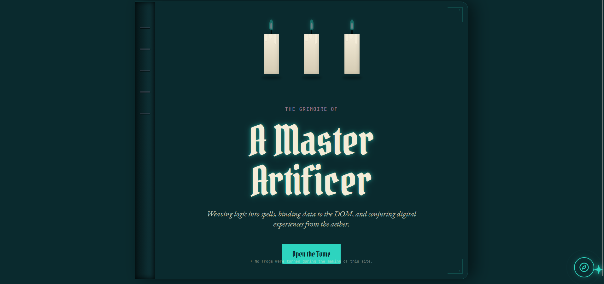](./images/screenshots/a-master-artificer-screenshot-01.png)

[Open the live demo](https://apursley2012.github.io/a-master-artificer/) · [Browse the full theme collection](https://github.com/apursley2012/github-pages-themes) · [Report an issue or request an addition](https://github.com/apursley2012/a-master-artificer/issues/new/choose)

</div>

---

## Table of Contents

- [Theme Overview](#theme-overview)
  - [Purpose](#purpose)
  - [Intended Users](#intended-users)
  - [Design Style and Inspiration](#design-style-and-inspiration)
  - [Main Color Palette](#main-color-palette)
  - [Preview Screenshots](#preview-screenshots)
- [Pages Included](#pages-included)
- [Component Architecture](#component-architecture)
  - [Shared Theme Components](#shared-theme-components)
  - [Shared Site Assets](#shared-site-assets)
  - [Theme-Specific Interactive Behavior](#theme-specific-interactive-behavior)
- [File and Folder Structure](#file-and-folder-structure)
- [Static Project Notes](#static-project-notes)
- [Customization Guide](#customization-guide)
  - [Personal Information and Branding](#personal-information-and-branding)
  - [Biography and Life Story](#biography-and-life-story)
  - [Projects, Skills, Services, and Experience](#projects-skills-services-and-experience)
  - [Contact Information and Social Links](#contact-information-and-social-links)
  - [Images and Screenshots](#images-and-screenshots)
  - [Colors, Fonts, and Styling](#colors-fonts-and-styling)
  - [Navigation](#navigation)
  - [Theme-Specific Editing Checklist](#theme-specific-editing-checklist)
- [GitHub Pages Deployment](#github-pages-deployment)
  - [Required Repository Structure](#required-repository-structure)
  - [Upload the Theme Files](#upload-the-theme-files)
  - [Enable GitHub Pages](#enable-github-pages)
  - [Confirm the Published URL](#confirm-the-published-url)
  - [Update the Published Site](#update-the-published-site)
  - [Important GitHub Pages Files](#important-github-pages-files)
  - [Common GitHub Pages Problems](#common-github-pages-problems)
- [Reporting Theme Issues or Requesting Additions](#reporting-theme-issues-or-requesting-additions)
- [Accessibility and Browser Compatibility](#accessibility-and-browser-compatibility)
  - [Accessibility Considerations](#accessibility-considerations)
  - [Browser Compatibility](#browser-compatibility)
- [Repository Relationship](#repository-relationship)
- [Custom Theme Requests](#custom-theme-requests)
- [Possible Future Enhancements](#possible-future-enhancements)
- [Copyright](#copyright)

---

## Theme Overview

<details open>
<summary>About this theme</summary>

### Purpose

I created **A Master Artificer** as a ready-to-publish static portfolio theme for GitHub Pages. I wanted this design to feel like a complete website instead of a plain starter layout, so the theme includes a homepage, portfolio pages, writing or case-study areas when present, contact information, shared styling, and theme-specific interface details.

The purpose of this theme is to give someone a portfolio that already has a clear point of view. A portfolio should show the work, but it should also show the person behind the work. With this design, I focused on making the visual style memorable while still keeping the structure practical enough for real projects, real writing, and real professional information.

This version is static, which means it can be uploaded directly to GitHub Pages without a build step, server, database, or package installation. That matters because not everyone using a portfolio theme wants to debug a development environment before they can publish a site. The files in this repository are meant to be edited, uploaded, and hosted as ordinary HTML, CSS, JavaScript, and image files.

### Intended Users

This theme is meant for developers, students, designers, writers, freelancers, and creative people who want a portfolio with more personality than a default landing page. It works especially well for someone who wants their site to feel designed, but still needs clear places for projects, skills, background, writing, and contact information.

I also designed it with beginners in mind. Someone does not need to be an expert in React, Vite, bundlers, or deployment tools to use this static version. The main requirement is knowing how to edit text in HTML files and upload files to a GitHub repository. The README explains those steps in plain language so the theme is useful to people at different comfort levels.

### Design Style and Inspiration

Category: **Developer and Desktop**

A Master Artificer is a static GitHub Pages portfolio theme designed to give personal work a specific visual identity instead of a generic template feeling. I approached the design by treating the theme concept as more than decoration. The visual style is used to organize the page, create hierarchy, guide attention, and help the portfolio feel cohesive from section to section.

My design process for this theme started with the feeling I wanted the visitor to have when the page first loads. From there, I built the layout around a few design basics that apply no matter how stylized a theme becomes: readable text, clear navigation, consistent spacing, recognizable sections, and contrast that separates content from decoration.

The stronger visual pieces are intentionally balanced with practical structure. I do not want the theme to be interesting for five seconds and frustrating after that. The design decisions are tied back to usability where possible: repeated page framing supports consistency, visible navigation supports recognition over recall, spacing improves scanability, and accent colors are used to draw attention instead of competing with every piece of text at once.

I also kept the theme modular. Components and assets are separated so the design is easier to adjust without tearing apart the whole site. That follows a basic front-end best practice: keep repeated interface patterns reusable, keep styling centralized where possible, and avoid hiding important content inside decorative effects.

### Main Color Palette

The theme styling uses the following palette from the actual static CSS and generated assets:

| Color | Primary Use |
| --- | --- |
| `#0000` | Used in the theme styling for contrast, surface color, accents, backgrounds, or decorative effects |
| `rgb(0 0 0 / .1)` | Used in the theme styling for contrast, surface color, accents, backgrounds, or decorative effects |
| `#2DD4BF4D` | Used in the theme styling for contrast, surface color, accents, backgrounds, or decorative effects |
| `rgb(45 212 191 / var(--tw-text-opacity, 1)` | Used in the theme styling for contrast, surface color, accents, backgrounds, or decorative effects |
| `#2DD4BF33` | Used in the theme styling for contrast, surface color, accents, backgrounds, or decorative effects |
| `#2DD4BF80` | Used in the theme styling for contrast, surface color, accents, backgrounds, or decorative effects |
| `#2DD4BF1A` | Used in the theme styling for contrast, surface color, accents, backgrounds, or decorative effects |
| `#1A3C404D` | Used in the theme styling for contrast, surface color, accents, backgrounds, or decorative effects |
| `#D4CBB3` | Used in the theme styling for contrast, surface color, accents, backgrounds, or decorative effects |
| `rgb(10 42 46 / var(--tw-bg-opacity, 1)` | Used in the theme styling for contrast, surface color, accents, backgrounds, or decorative effects |
| `rgb(244 236 216 / var(--tw-text-opacity, 1)` | Used in the theme styling for contrast, surface color, accents, backgrounds, or decorative effects |
| `rgb(10 42 46 / var(--tw-text-opacity, 1)` | Used in the theme styling for contrast, surface color, accents, backgrounds, or decorative effects |

The palette is part of the theme identity, but it also supports visual hierarchy. Background and surface colors help create separation between sections, while accent colors are used for emphasis, links, buttons, borders, and decorative details. When editing colors, keep contrast in mind first. A theme can be expressive and still be readable.

### Preview Screenshots

Click any preview link or image to open the full-size file.

<p align="center">
  
  &nbsp;&nbsp;
  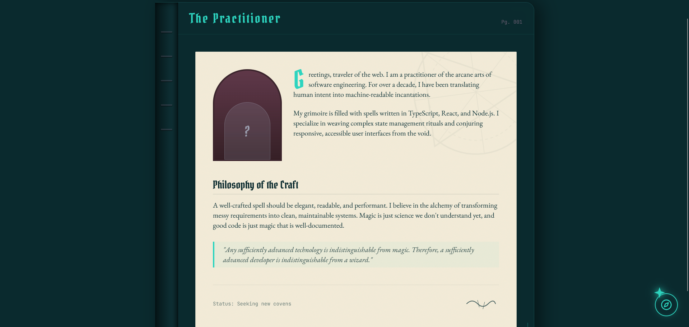
</p>
<p align="center">
  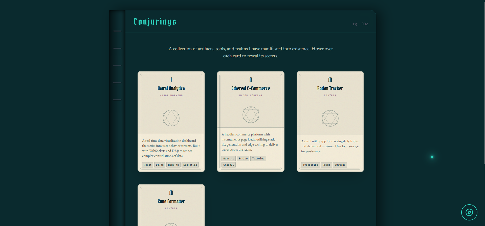
  &nbsp;&nbsp;
  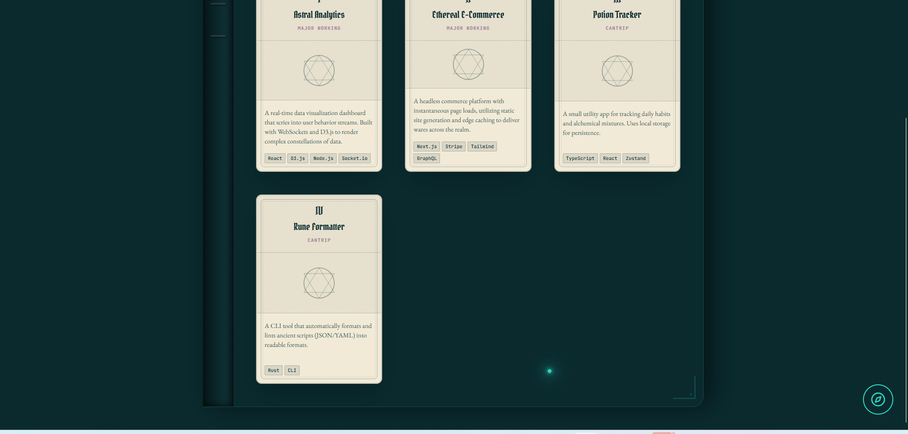
</p>
<p align="center">
  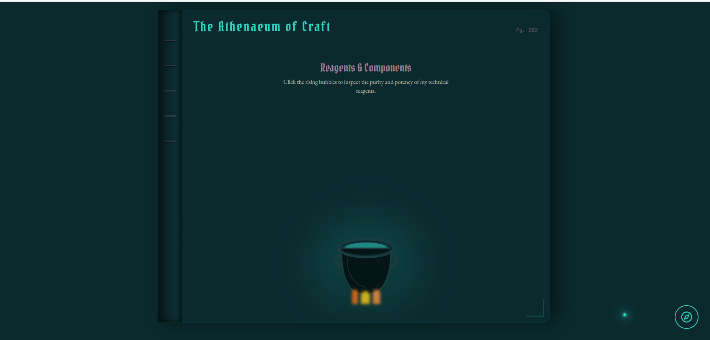
  &nbsp;&nbsp;
  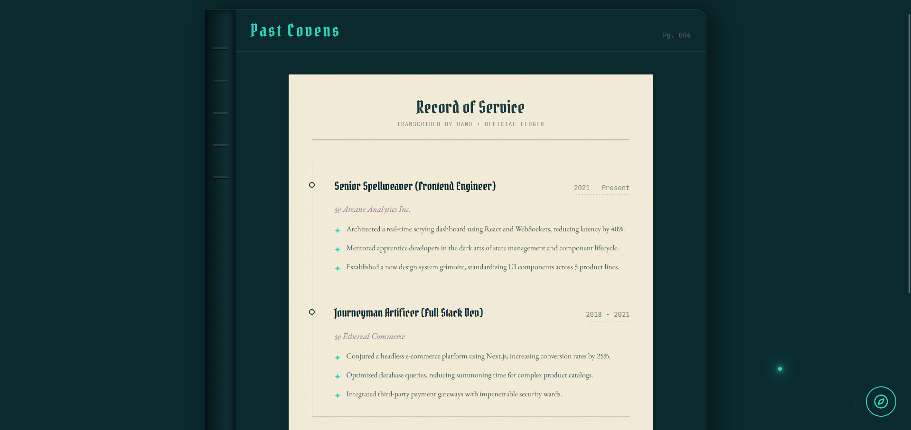
</p>
<p align="center">
  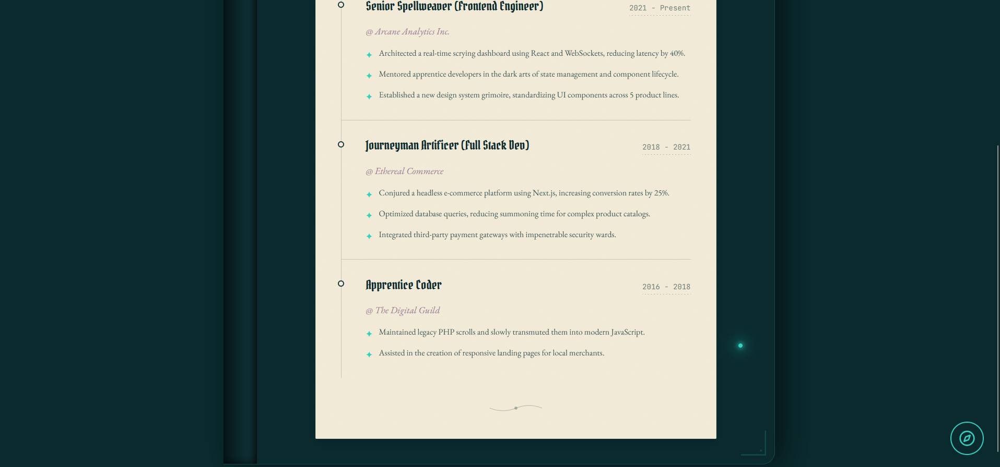
  &nbsp;&nbsp;
  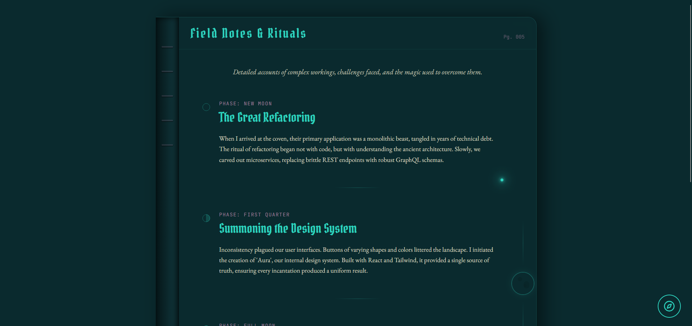
</p>
<p align="center">
  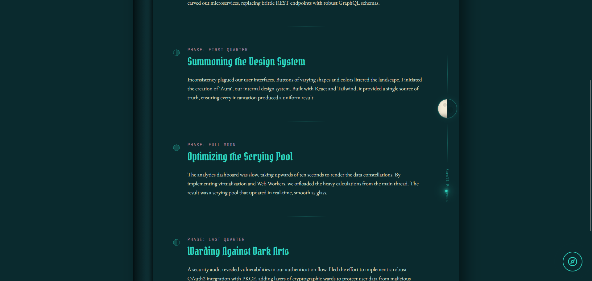
  &nbsp;&nbsp;
  
</p>
<p align="center">
  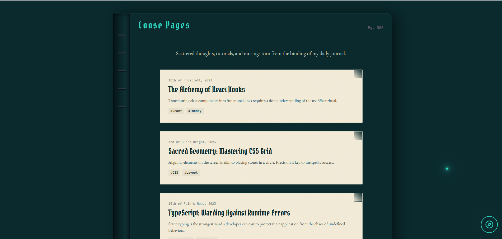
  &nbsp;&nbsp;
  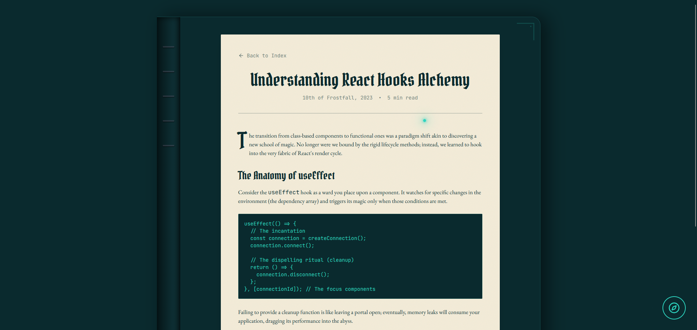
</p>
<p align="center">
  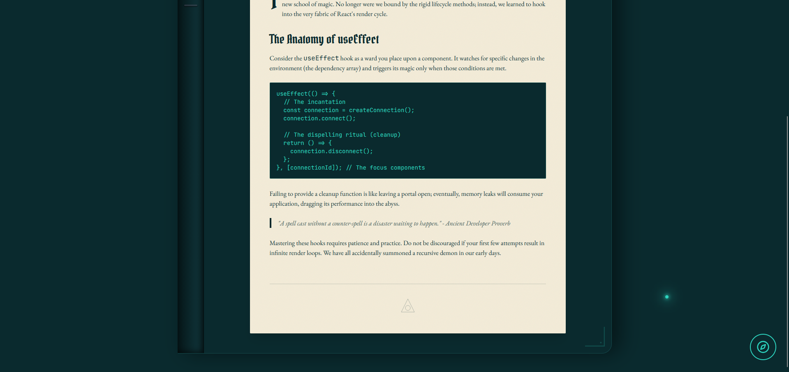
  &nbsp;&nbsp;
  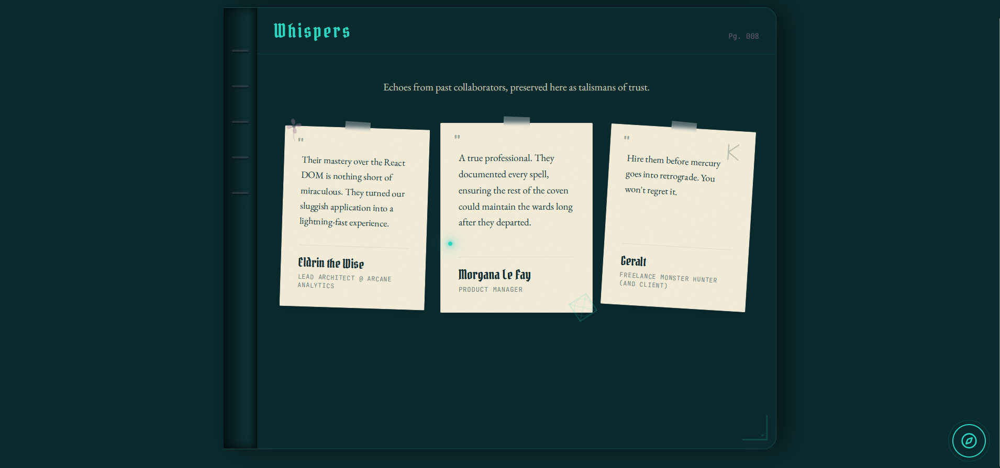
</p>
<p align="center">
  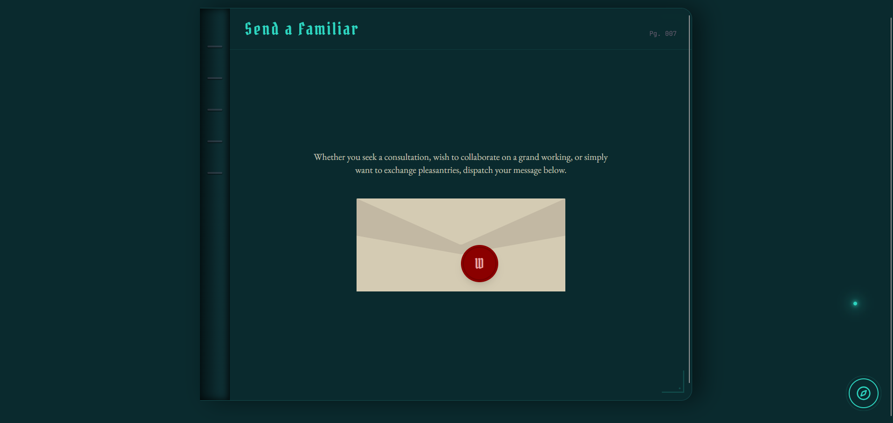
  &nbsp;&nbsp;
  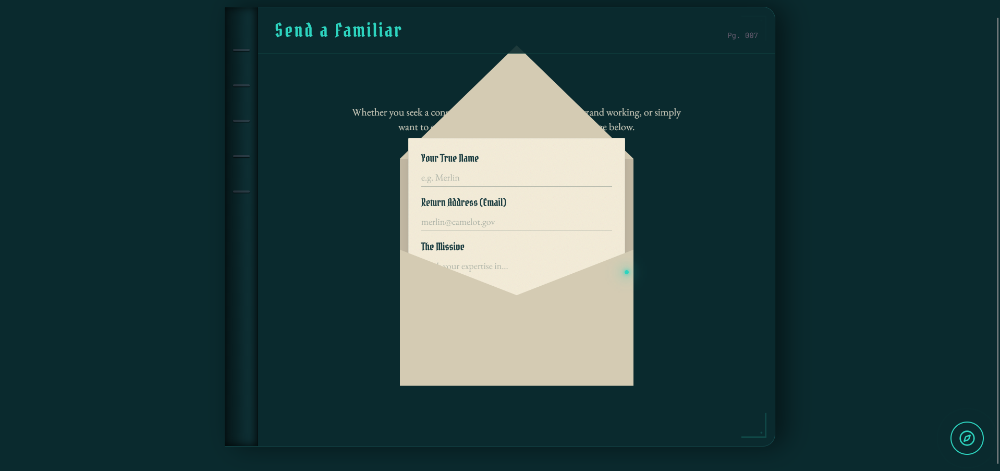
</p>

#### Screenshot Gallery

[Open the screenshot folder](./images/screenshots/)

</details>

---

## Pages Included

<details open>
<summary>View included pages</summary>

The portfolio pages are kept as separate HTML entry files so they can be opened directly and hosted cleanly with GitHub Pages.

| Page | Purpose |
| --- | --- |
| `index.html` | Main homepage and GitHub Pages entry file |
| `pages/About.html` | Standalone portfolio page included with this static theme |
| `pages/Article.html` | Standalone portfolio page included with this static theme |
| `pages/BlogIndex.html` | Standalone portfolio page included with this static theme |
| `pages/CaseStudies.html` | Standalone portfolio page included with this static theme |
| `pages/Contact.html` | Standalone portfolio page included with this static theme |
| `pages/Projects.html` | Standalone portfolio page included with this static theme |
| `pages/Skills.html` | Standalone portfolio page included with this static theme |
| `pages/Testimonials.html` | Standalone portfolio page included with this static theme |
| `pages/Work.html` | Standalone portfolio page included with this static theme |

`index.html` is the homepage and GitHub Pages entry file. It should stay at the root of the repository so the site loads automatically when someone visits the published URL.

Separating the pages also makes the theme easier to edit. A person can update the About page without digging through the Projects page, or change contact details without disturbing the rest of the layout. That structure is useful for beginners and for anyone maintaining the site over time.

</details>

---

## Component Architecture

<details open>
<summary>View components, assets, and interaction behavior</summary>

### Shared Theme Components

| Component | Purpose |
| --- | --- |
| No separate component files | This theme keeps its interface behavior inside the main static assets rather than a separate component folder. |

### Shared Site Assets

| Asset | Purpose |
| --- | --- |
| `assets/About.js` | Supports the About page or shared module in the static build, keeping page behavior separated from the HTML entry files. |
| `assets/Article.js` | Supports the Article page or shared module in the static build, keeping page behavior separated from the HTML entry files. |
| `assets/BlogIndex.js` | Supports the BlogIndex page or shared module in the static build, keeping page behavior separated from the HTML entry files. |
| `assets/CaseStudies.js` | Supports the CaseStudies page or shared module in the static build, keeping page behavior separated from the HTML entry files. |
| `assets/Contact.js` | Supports the Contact page or shared module in the static build, keeping page behavior separated from the HTML entry files. |
| `assets/Home.js` | Supports the Home page or shared module in the static build, keeping page behavior separated from the HTML entry files. |
| `assets/Projects.js` | Supports the Projects page or shared module in the static build, keeping page behavior separated from the HTML entry files. |
| `assets/Skills.js` | Supports the Skills page or shared module in the static build, keeping page behavior separated from the HTML entry files. |
| `assets/Testimonials.js` | Supports the Testimonials page or shared module in the static build, keeping page behavior separated from the HTML entry files. |
| `assets/Work.js` | Supports the Work page or shared module in the static build, keeping page behavior separated from the HTML entry files. |
| `assets/main.css` | Contains the primary visual system for the static theme, including layout, responsive behavior, color usage, spacing, typography, and decorative effects. |
| `assets/main.js` | Bootstraps the static site in the browser, connects the generated page modules, and loads the interactive behavior used by the portfolio pages. |
| `assets/proxy.js` | Provides compatibility glue from the static build so generated modules can run after the project is flattened for GitHub Pages. |
| `assets/use-transform.js` | Supports the use-transform page or shared module in the static build, keeping page behavior separated from the HTML entry files. |

### Theme-Specific Interactive Behavior

The interactive behavior in this theme is used to support the design, not to hide the content. Effects are decorative where they should be decorative, and navigation remains based on normal links so the site is easier to understand, troubleshoot, and publish.

- The primary interaction behavior is handled by the main static JavaScript file and standard page links.

This structure also makes the design easier to customize. A themed cursor, animated background, window panel, or navigation component can be edited in its own file instead of forcing every page to be rewritten. That follows the same principle used in larger front-end projects: repeated behavior belongs in reusable pieces, while page content should stay easy to find.

</details>

---

## File and Folder Structure

<details open>
<summary>View repository structure</summary>

```text
a-master-artificer/
├── .nojekyll
├── GITHUB-REPO-DESCRIPTION.txt
├── GITHUB-REPO-TOPICS.txt
├── README.md
├── assets/
│   ├── About.js
│   ├── Article.js
│   ├── BlogIndex.js
│   ├── CaseStudies.js
│   ├── Contact.js
│   ├── Home.js
│   ├── Projects.js
│   ├── Skills.js
│   ├── Testimonials.js
│   ├── Work.js
│   ├── main.css
│   ├── main.js
│   ├── proxy.js
│   ├── use-transform.js
├── components/
│   ├── grimoire/
│   │   ├── AstrolabeNav.js
│   │   ├── CustomCursor.js
│   │   ├── PageChrome.js
├── images/
│   ├── screenshots/
│   │   ├── a-master-artificer-screenshot-01.png
│   │   ├── a-master-artificer-screenshot-02.png
│   │   ├── a-master-artificer-screenshot-03.png
│   │   ├── a-master-artificer-screenshot-04.png
│   │   ├── a-master-artificer-screenshot-05.png
│   │   ├── a-master-artificer-screenshot-06.png
│   │   ├── a-master-artificer-screenshot-07.png
│   │   ├── a-master-artificer-screenshot-08.png
│   │   ├── a-master-artificer-screenshot-09.png
│   │   ├── a-master-artificer-screenshot-10.png
│   │   ├── a-master-artificer-screenshot-11.png
│   │   ├── a-master-artificer-screenshot-12.png
│   │   ├── a-master-artificer-screenshot-13.png
│   │   ├── a-master-artificer-screenshot-14.png
│   │   ├── a-master-artificer-screenshot-15.png
│   │   ├── a-master-artificer-screenshot-16.png
├── index.html
├── pages/
│   ├── About.html
│   ├── Article.html
│   ├── BlogIndex.html
│   ├── CaseStudies.html
│   ├── Contact.html
│   ├── Projects.html
│   ├── Skills.html
│   ├── Testimonials.html
│   ├── Work.html
```

The folders work together as follows:

- `index.html` is the homepage and GitHub Pages entry file.
- Root-level `.html` files are direct portfolio pages when they are included.
- `pages/` stores additional page entry files when the static conversion uses that folder.
- `components/` stores reusable interface behavior and theme-specific visual pieces.
- `assets/` stores shared styles, generated JavaScript, and static build helpers.
- `images/screenshots/` stores the README preview screenshots.
- `.nojekyll` tells GitHub Pages to publish the files directly without trying to process the site as a Jekyll project.

</details>

---

## Static Project Notes

<details open>
<summary>Read static hosting notes</summary>

This repository is designed for direct static hosting. The finished theme does not require installing dependencies, running a local build command, or connecting a backend service.

- The homepage is `index.html`.
- The included HTML files can be opened directly in a browser or published through GitHub Pages.
- Shared styles and scripts stay organized inside the folders included with the theme.
- Internal paths are written as relative paths so the theme works from a GitHub Pages project URL.
- `.nojekyll` should stay beside `index.html`.
- The repository should be published from the root folder unless the theme is intentionally moved into a subfolder.

For GitHub Pages, relative paths are important because project sites are usually served from a URL like `https://username.github.io/repository-name/`. Links that start with `/` can accidentally point to the root of the entire domain instead of the repository folder. This theme uses repository-safe paths so CSS, JavaScript, images, screenshots, and page links work correctly after publishing.

</details>

---

## Customization Guide

<details open>
<summary>How to make this theme your own</summary>

### Personal Information and Branding

Start with `index.html`. Update the displayed name, headline, short introduction, and any labels that describe the portfolio owner. I usually edit the homepage first because it sets the tone for the entire site. Once the homepage feels right, the rest of the pages are easier to align with that voice.

### Biography and Life Story

Update the About page when it is included. This is the best place to explain background, education, career direction, interests, creative influences, or the path that led to the work being shown. The design gives the biography its own space so visitors can understand the person behind the projects without making the homepage too crowded.

### Projects, Skills, Services, and Experience

Use the included portfolio pages to replace the sample content with real work. Common editing locations include:

- `projects.html` for featured projects, screenshots, descriptions, and links
- `skills.html` for languages, tools, technologies, and capabilities
- `work.html` for professional experience or work history
- `casestudies.html` for deeper project breakdowns
- `article.html` or `blogindex.html` for writing and long-form notes
- `testimonials.html` for feedback, recommendations, or client/student/project comments

When editing project content, keep descriptions specific. A strong portfolio project should explain what the project does, why it was built, what technologies were used, what decisions mattered, and what the finished result demonstrates.

### Contact Information and Social Links

Update the contact page and any footer links before publishing. Replace placeholder links with the correct email, GitHub, LinkedIn, portfolio, résumé, or other preferred contact methods. For this theme collection, my public contact paths are:

- GitHub: `https://github.com/apursley2012`
- Portfolio: `https://apursley2012.github.io/eportfolio/`
- Theme collection: `https://github.com/apursley2012/github-pages-themes`

### Images and Screenshots

Store added images inside `images/` or a clearly named subfolder. Repository preview screenshots belong in:

```text
images/screenshots/
```

The screenshots included with this theme are named to match the theme folder so the README paths stay predictable. When replacing screenshots, keep the same filenames or update the README image paths at the same time.

### Colors, Fonts, and Styling

Most visual changes should start in `assets/main.css` when that file is included. Use targeted edits instead of rewriting the whole stylesheet. This helps preserve spacing, responsive behavior, contrast, and the visual rhythm of the design.

Design best practice matters here: change colors carefully, test contrast, and make sure text remains readable on mobile screens. A beautiful palette does not help if visitors cannot read the project descriptions.

### Navigation

Test every navigation link after editing. GitHub Pages paths are case-sensitive, so `Projects.html` and `projects.html` are not the same thing.

For the homepage, use:

```html
<a href="index.html">Home</a>
```

### Theme-Specific Editing Checklist

1. Update the homepage name, headline, and introduction.
2. Replace About content with the portfolio owner's real background.
3. Replace project cards, case studies, writing, skills, testimonials, and work-history content where those pages are included.
4. Update contact details and external profile links.
5. Replace screenshots in `images/screenshots/` after customizing the site.
6. Review the color palette only after the content is in place, because content length can change how the design feels.
7. Test navigation from every page, not only from the homepage.
8. Open the site on a phone-width screen and check spacing, headings, buttons, and screenshots.
9. Keep `index.html` and `.nojekyll` at the repository root.
10. Publish through GitHub Pages and check the live URL after deployment finishes.

</details>

---

## GitHub Pages Deployment

<details open>
<summary>Beginner-friendly publishing guide</summary>

GitHub Pages is a free way to publish static websites from a GitHub repository. A static website is made from files like HTML, CSS, JavaScript, and images. Since this theme is already static, GitHub can serve it directly.

### Required Repository Structure

Upload the **contents** of the theme folder so `index.html` sits directly at the repository root.

Correct:

```text
a-master-artificer/
├── .nojekyll
├── index.html
├── assets/
├── images/
└── README.md
```

Incorrect:

```text
a-master-artificer/
└── a-master-artificer/
    ├── index.html
    └── assets/
```

### Upload the Theme Files

To upload through the GitHub website:

1. Create or open the repository.
2. Select **Add file**.
3. Select **Upload files**.
4. Drag the theme files and folders into the upload area.
5. Confirm that `index.html` appears at the top level of the repository.
6. Confirm that `.nojekyll`, `assets/`, `components/`, `pages/`, and `images/` were uploaded when those folders are included.
7. Add a commit message.
8. Select **Commit changes**.

### Enable GitHub Pages

1. Open the repository on GitHub.
2. Select **Settings**.
3. Select **Pages** from the sidebar.
4. Under **Build and deployment**, choose **Deploy from a branch**.
5. Select:

   ```text
   Branch: main
   Folder: / (root)
   ```

6. Select **Save**.

### Confirm the Published URL

The live GitHub Pages URL for this repository is expected to be:

```text
https://apursley2012.github.io/a-master-artificer/
```

Open the URL and test the homepage, navigation, images, styling, and interactive details.

### Update the Published Site

Committed changes to the selected publishing branch are republished automatically.

To update files through the GitHub website:

1. Open the repository.
2. Open the file to edit.
3. Select the pencil-shaped **Edit this file** button.
4. Make the change.
5. Select **Commit changes**.
6. Refresh the live site after the update is published.

### Important GitHub Pages Files

#### `index.html`

`index.html` is the homepage and GitHub Pages entry file. It must remain at the repository root.

#### `.nojekyll`

`.nojekyll` is an empty file stored beside `index.html`. The filename is the instruction. It should remain completely empty.

Correct:

```text
.nojekyll
```

Incorrect:

```text
nojekyll
.nojekyll.txt
nojekyll.md
```

#### Why `_config.yml` Is Not Required

This theme does not require `_config.yml` or `config.yaml`. Keeping `.nojekyll` at the repository root tells GitHub Pages to publish the files directly.

### Common GitHub Pages Problems

#### The site shows a 404 page

Confirm that GitHub Pages is enabled, the selected source is `main` and `/(root)`, `index.html` is at the repository root, and the files were not uploaded inside an extra folder layer.

#### The site is blank or missing styling

Confirm that all included asset folders were uploaded, file paths were not changed, and filenames match exactly, including capitalization.

#### Images do not load

Confirm that the complete `images/` folder was uploaded and that screenshot filenames match the paths used in this README.

#### The homepage does not load automatically

Confirm that the homepage is named exactly `index.html`.

#### The `.nojekyll` file looks empty

That is correct. It is supposed to be empty.

#### Changes do not appear immediately

Confirm that the latest changes were committed to the selected branch, the correct file was edited, and the browser is not showing a cached copy.

</details>

---

## Reporting Theme Issues or Requesting Additions

<details open>
<summary>Issues and feature requests</summary>

Use the repository's issue forms:

[Report an issue or request an addition](https://github.com/apursley2012/a-master-artificer/issues/new/choose)

When reporting an issue, include the affected page, the browser or device being used, a description of what happened, and a screenshot when possible. Clear reports make it easier to fix broken paths, layout issues, missing images, or mobile behavior problems.

</details>

---

## Accessibility and Browser Compatibility

<details open>
<summary>Accessibility and browser notes</summary>

### Accessibility Considerations

Before publishing a personalized version, test:

- Keyboard navigation
- Link focus states
- Mobile-width behavior
- Image alternative text
- Heading order
- Reduced-motion preferences
- Color contrast
- Readability of decorative text

Decorative effects should not block navigation, trap focus, or flash rapidly. The theme can have personality, but the content still needs to be usable for visitors with different devices, preferences, and accessibility needs.

### Browser Compatibility

The project is intended for current versions of Chrome, Firefox, Safari, and Edge. Test the final personalized version on both desktop and mobile screens because decorative elements can make spacing changes more noticeable.

</details>

---

## Repository Relationship

<details open>
<summary>How this repository fits into the full collection</summary>

This theme is maintained as a standalone repository and linked from the main GitHub Pages Portfolio Themes collection.

- Live GitHub Pages demo: `https://apursley2012.github.io/a-master-artificer/`
- Main collection repository: `https://github.com/apursley2012/github-pages-themes`
- Main collection visual theme gallery: `https://apursley2012.github.io/github-pages-themes/`

The main collection repository acts as a directory. It links visitors to this theme's live demo, repository, and issue-request form.

</details>

---

## Custom Theme Requests

<details open>
<summary>Custom GitHub Pages theme work</summary>

I create custom GitHub Pages themes for people who want a portfolio, project site, or personal website that feels more specific than a generic template. A custom theme can be minimal, professional, retro, magical, colorful, spooky, technical, story-based, or built around a completely different idea.

For custom theme requests, questions, or collaboration ideas, contact me through:

- GitHub: `https://github.com/apursley2012`
- Portfolio: `https://apursley2012.github.io/eportfolio/`
- Theme collection: `https://github.com/apursley2012/github-pages-themes`

</details>

---

## Possible Future Enhancements

<details open>
<summary>Future improvement ideas</summary>

- Add or refresh repository screenshots after major visual updates.
- Add a themed `404.html` page for visitors who open a broken link.
- Add an optional reduced-motion toggle for themes with heavier animation.
- Expand the issue-request form as the theme collection grows.
- Add more accessibility refinements after testing with real personalized content.
- Add more documentation examples for common portfolio edits.

</details>

---

## Copyright

Copyright © 2026 Alysha Pursley. All rights reserved.

This theme and its documentation are maintained by Alysha Pursley.
